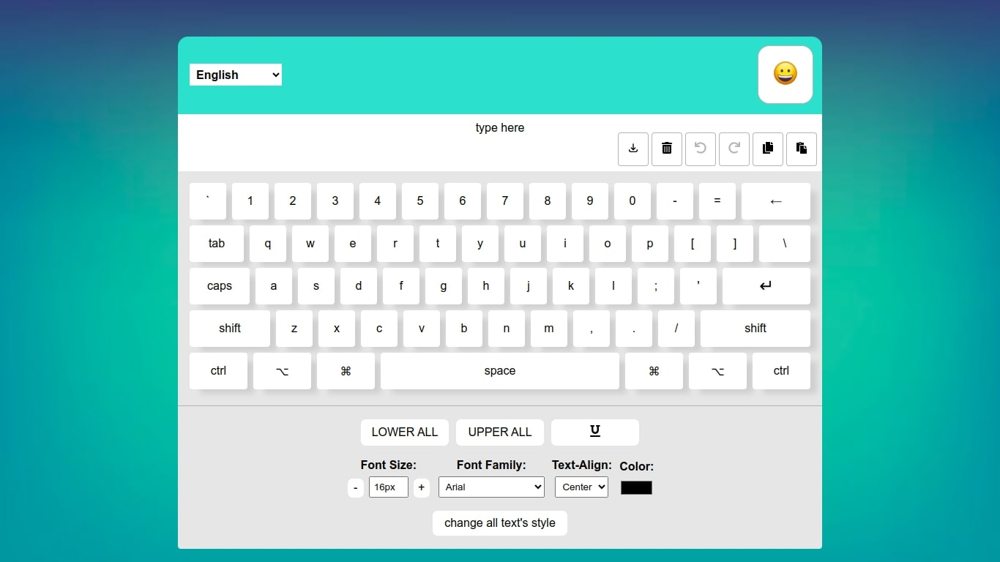

# Virtual Keyboard App

This is a React-based virtual keyboard app with support for multiple languages and emoji input.

## Table of Contents

-   [Features](#features)
-   [Demo](#demo)
-   [Installation](#installation)

## Features

-   Virtual keyboard with support for Hebrew, English, Arabic, Ukranian, Russian, Polish, Portuguese, Spanish, Macedonian, Hindi and Persian languages.
-   Emoji keyboard for expressive input.
-   Stylish and customizable interface.
-   Undo and redo functionality.

## Demo



## Installation

To run this project locally, follow these steps:

1. Clone the repository:

```bash
git clone https://github.com/GouravSinghDosad/VK-the-Virtual-Keyboard.git
```

2. open the project in terminal and then run:

```bash
npm install
npm run dev
```

## Project Structure

The project follows a specific structure to organize its files and directories. Below is an overview of the main components:

```plaintext
virtual-keyboard/
│
├── src/                    # Source code directory
│   ├── assets/             # Static assets like images, icons, etc.
│   │   ├── images/         # Image files
│   │   │   ├── emojiButton.webp       # Image of emoji
│   │   │   └── backgroundImage.jpg    # Image of background
│   ├── components/         # React components
│   │   ├── VirtualKeyboard.jsx     # Main virtual keyboard component
│   │   ├── SpecialButtons.jsx      # Component for special buttons such as:redo, undo and clear all the text
|   |   ├── Screen.jsx      # the text the user typed
|   |   ├── EmojiKeyBoard.jsx
|   |   ├── KeyBoard.jsx
|   |   ├── KeyBoardLanguage.tsx
|   |   ├── KeyBoardStylee.css
│   │   ├── keyboardStyles.css    # Styles for the virtual keyboard
│   │   └── ...             # Other files
│   ├── redux/              # 
|   |   ├── reducer.js      # 
|   |   └── store.js        # 
│   ├── App.css             # Root css
│   ├── App.jsx             # App function for calling main VirtualKeyboard component
│   ├── index.css           # Body css
│   ├── letterStyle.js      # Font class
│   ├── main.jsx            # Main application component
│
├── public/                 # Public directory for static files
│   ├── keyboard.png        # Image of keyboard
│   └── ...
│
├── .gitignore              # Git ignore file
├── package.json            # Node.js project configuration
├── README.md               # Project documentation
├── index.html              # Main HTML file
 ...                        # Other configuration files
```


## Contact

If you have any questions, suggestions, or issues regarding the virtual-keyboard, 
please feel free to reach out to us through the [Issues](https://github.com/GouravSinghDosad/VK-the-Virtual-Keyboard/issues) section of this repository.
You can also discuss with as in the discussion template, there are there meaningfull discussion.
You can also contact me via my [email](mailto:d.gouravsingh.941@gmail.com).

